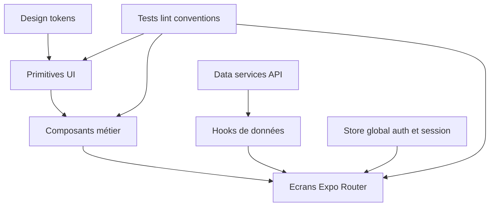

# Modernisation complète de l’application — Audit et roadmap

## 1) Audit synthétique de l’existant

### Stack et fondations
- Frontend Expo Router + React Native moderne: [`frontend/package.json`](frontend/package.json)
- État global via Zustand: [`useAuthStore`](frontend/src/store/authStore.ts:22)
- API client centralisé Axios avec retry: [`ApiClient`](frontend/src/services/apiClient.ts:20)
- Design tokens déjà présents: [`Colors`](frontend/src/constants/colors.ts:2), [`Spacing`](frontend/src/constants/spacing.ts:2), [`Typography`](frontend/src/constants/spacing.ts:49)

### Forces observées
- Base technique saine et récente (React 19, RN 0.81, Expo 54)
- Architecture par domaines d’écrans cohérente sous [`frontend/app`](frontend/app)
- Composants UI réutilisables existants (boutons, champs, cartes)
- Navigation tab bien organisée avec routes cachées dans [`MainLayout`](frontend/app/(main)/_layout.tsx:26)

### Gaps de modernisation

#### Design system et cohérence visuelle
- Tokens présents mais adoption inégale entre écrans
- Styles locaux volumineux et redondants, ex. [`HomeScreen`](frontend/app/(main)/(home)/home.tsx:124), [`LoginScreen`](frontend/app/(auth)/login.tsx:14), [`RegisterScreen`](frontend/app/(auth)/register.tsx:14)
- Manque d’un niveau de composants de layout moderne (Screen, Card, Section, List primitives)

#### Navigation et UX
- Navigation fonctionnelle mais manque de standards UX transverses
  - gestion chargement unifiée
  - empty/error states homogènes
  - feedbacks et transitions plus modernes

#### Data layer et robustesse
- API client robuste, mais écarts de clés token entre [`ApiClient`](frontend/src/services/apiClient.ts:45) et [`authStore`](frontend/src/store/authStore.ts:5)
- Gestion d’erreurs surtout locale écran par écran
- Peu de normalisation des patterns de fetch/cache côté UI

#### Performance
- Gros écrans à logique dense et rendu monolithique, ex. [`HomeScreen`](frontend/app/(main)/(home)/home.tsx:124)
- Potentiel de gains via découpage composants, mémoïsation ciblée, listes virtualisées, skeletons systématiques

#### Qualité et tests
- Tests présents mais limités pour services/constants
- Couverture UI/flows critiques à renforcer

---

## 2) Architecture cible de modernisation

### Cible
- UI cohérente, premium, rapide
- Couche data prévisible et standardisée
- Composants réutilisables et évolutifs
- Qualité continue via tests + conventions

### Principes de migration
1. Incrémental sans rupture
2. Mobile-first et accessibilité native
3. Token-first pour tout style
4. Feature-based pour maintenir la lisibilité
5. Definition of Done stricte par écran

### Blueprint cible

---

## 3) Roadmap de modernisation par phases

## Phase 0 — Cadre et standards
- Stabiliser conventions frontend
- Définir règles de style et structure dossier
- Ajouter checklist de qualité par PR

Livrables
- Guide conventions frontend dans [`plans/`](plans)
- Checklist qualité UI/data/test

## Phase 1 — Refonte design system
- Consolider tokens et aliases sémantiques
- Créer primitives modernes
  - Screen container
  - AppCard
  - AppListItem
  - AppBadge
  - AppSkeleton
  - AppTopBar
- Harmoniser boutons et champs existants

Livrables
- Token map v2
- Bibliothèque primitives prête à adopter

## Phase 2 — UX shell et navigation
- Uniformiser header, safe area, spacing vertical
- Standardiser patterns empty/loading/error
- Harmoniser navigation tab + parcours secondaires

Livrables
- Shell navigation modernisé
- Patterns UX partagés intégrés

## Phase 3 — Données et état applicatif
- Corriger la stratégie token auth de bout en bout
- Introduire hooks de données normalisés
- Uniformiser gestion erreurs/feedbacks

Livrables
- Contrat auth/API aligné
- Hooks data réutilisables par feature

## Phase 4 — Modernisation écrans prioritaires
Ordre recommandé
1. Auth: login/register/forgot
2. Home
3. Catalog + Product details
4. Cart + checkout
5. Profile + settings + support
6. Subscriptions + orders

Pour chaque écran
- Refactor UI vers primitives
- Uniformisation data flow
- Accessibilité et micro-interactions
- Test de non-régression

## Phase 5 — Performance et fiabilité
- Profiling rendu sur écrans lourds
- Optimisation listes/images/re-renders
- Durcissement gestion réseau et offline partiel

Livrables
- Rapport optimisation
- Correctifs ciblés validés

## Phase 6 — Qualité continue
- Renforcer tests unitaires UI et services
- Ajouter tests d’intégration sur flows critiques
- Pipeline lint/test en garde-fou systématique

Livrables
- Matrice de couverture critique
- Gates qualité prêts pour évolutions futures

---

## 4) Backlog exécutable multi-workstreams

### Workstream Design System
- Inventaire des styles locaux
- Mapping vers tokens
- Migration progressive composants transverses

### Workstream UX Navigation
- Standard de layout d’écran
- États de contenu unifiés
- Cohérence des interactions de navigation

### Workstream Data et Auth
- Alignement clés storage token/user
- Gestion globale erreurs API
- Hooks data unifiés

### Workstream Performance
- Audit des écrans coûteux
- Optimisations ciblées
- Validation ressenti fluidité

### Workstream Testing
- Priorisation des parcours critiques
- Tests composant + service + flux
- Stabilisation CI locale

---

## 5) Critères de succès
- Cohérence visuelle de bout en bout
- Réduction de duplication styles/composants
- Parcours auth/catalog/cart plus fluides
- Gestion d’erreur homogène
- Base de code plus maintenable pour les prochaines features
